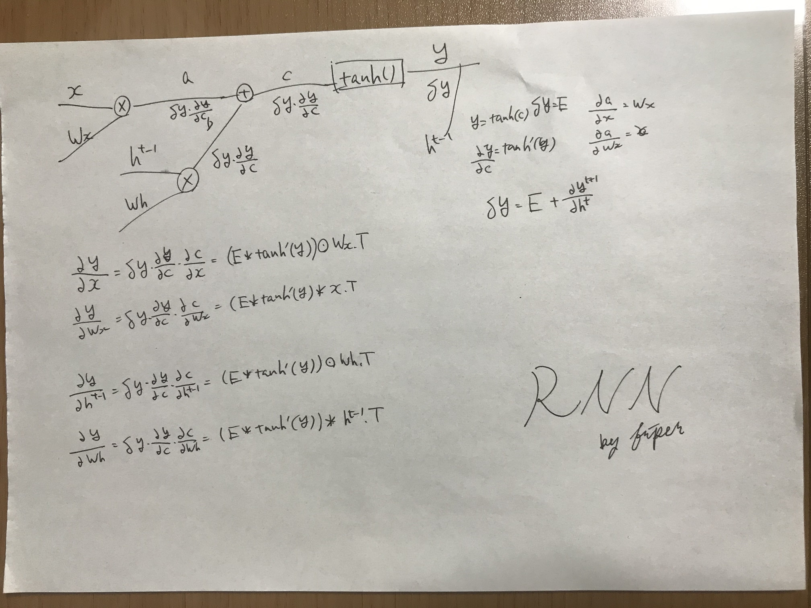
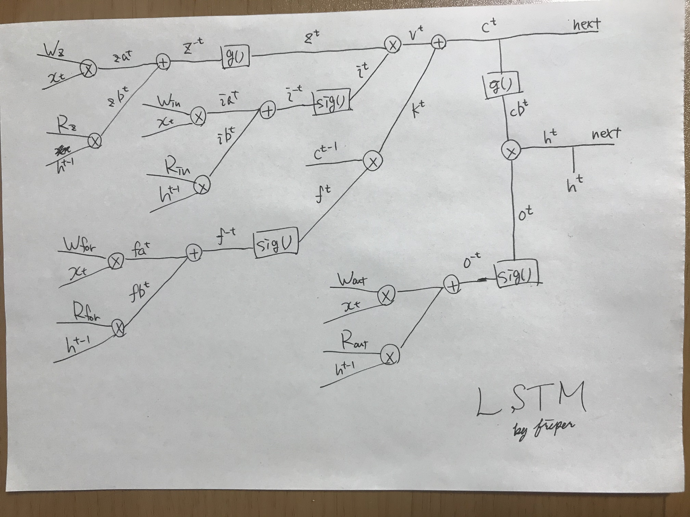
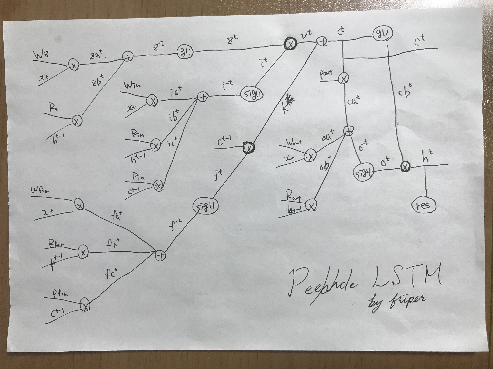
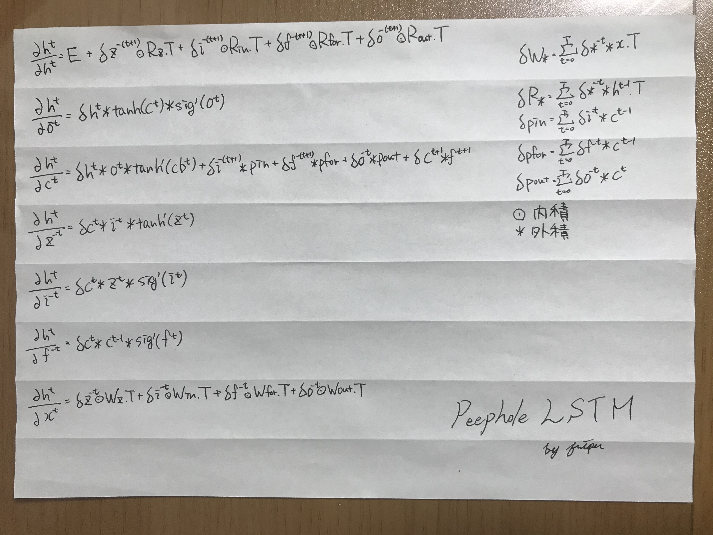

FULL BPTT LSTM
===

Overview

## Requirement

- Python 3.6.9
- numpy 1.18.3
- matplotlib 2.1.1

## Install
```
git clone https://github.com/friper/share.git
mv ./share/lstm <your path>/LSTM
rm -r share
```

## Run
```
python3 test.py
```

## Information

### RNN

**RNN Model**


### LSTM

**LSTM Model**


**Peephole LSTM Model**
 

**LSTM Calculate**


### Format

* train/test Data: [[[trainData1],[trainData2],...],[[teachData1],[teachData2],...]]

* predict Data: [predict Data]
